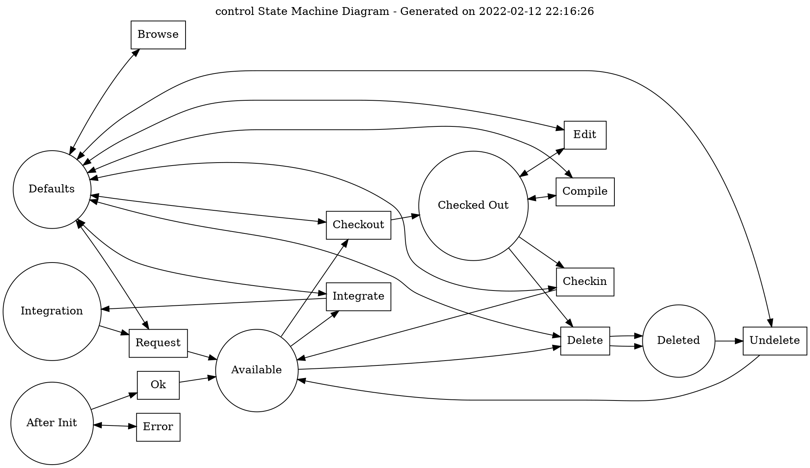

# StateMachineGenerator
This script converts libero state machine files into state machine diagrams.


# Dependencies
This script can be run on Python 3.7+ and requires the package GraphViz

# Manual
&emsp;-h, --help<br />
&emsp;&emsp;displays this text, then exits.<br />
&emsp;-i, --input-file<br />
&emsp;&emsp;the input libero state machine file to generate. A diagram and a dot file will be generated from the input file.<br />
&emsp;-o, --output-file<br />
&emsp;&emsp;the directory to output the dot and png files.<br />
&emsp;-n, --name<br />
&emsp;&emsp;sets the name for the output dot and png files.<br />
&emsp;-d, --dpi<br />
&emsp;&emsp;sets the dpi parameter for the generated image.<br />

# Example

$ StateMachineGenerator.py --i control.l


## Control.l
```
!
!   control.l   Dialog description for the monitor script
!
!   Written:    95/10/22  Pieter Hintjens
!   Revised:    95/10/22
!
-schema=lrschema.ksh

After-Init:
    (--) Ok                                 -> Available
          + Define-New-Program
          + Trigger-The-Same-Event
    (--) Error                              ->
          + Signal-Invalid-Operation
          + Terminate-The-Program

!   In this state a program is in development.  A developer can check-out
!   the program in advance of making changes.  The program is then locked.
!
Available:
    (--) Checkout                           -> Checked-Out
          + Lock-The-Program
    (--) Delete                             -> Deleted
          + Delete-The-Program
    (--) Integrate                          -> Integration
          +

!   In this state a program is checked-out by a developer.  Any other
!   developer can only browse the program, not modify it.
!
Checked-Out:
    (--) Checkin                            -> Available
          + Unlock-The-Program
    (--) Edit                               -> Checked-Out
          + Edit-The-Program
    (--) Compile                            -> Checked-Out
          + Compile-The-Program
    (--) Delete                             -> Deleted
          + Unlock-The-Program
          + Delete-The-Program

Deleted:
    (--) Undelete                           -> Available
          + Undelete-The-Program

!   The program is 'frozen' while being tested.  If a change request
!   comes along, the program is moved back into development so that
!   changes can be made.
!
Integration:
    (--) Request                            -> Available
          +

!   Browse is always permitted; we stay in the same state.
!   Any other action (not accepted in the current state) is rejected.
!
Defaults:
    (--) Browse                             ->
          + Browse-The-Program
    (--) Checkin                            ->
          + Reject-Operation
    (--) Checkout                           ->
          + Reject-Operation
    (--) Compile                            ->
          + Reject-Operation
    (--) Delete                             ->
          + Reject-Operation
    (--) Edit                               ->
          + Reject-Operation
    (--) Integrate                          ->
          + Reject-Operation
    (--) Request                            ->
          + Reject-Operation
    (--) Undelete                           ->
          + Reject-Operation
```

## Generated State Machine Diagram


## Generated Dot 


# Libero
https://github.com/imatix-legacy/libero

# License 

